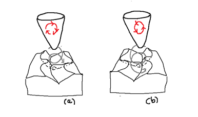

# Quadriphonic SQdecoder in less than 50 lines of golang

# or Analog Computing in Digital Computing Era : Part 1


I have always been fascinated by the process of recording images and sound and being able to reproduce it.

At six years old I was impressed by the story of Edison and his phonograph.("Mary had a little lamb...")

I would like now to highlight the differences between analog and digital design in storage and information processing.

In this part 1, the question that came to my mind was:

- How to engrave an analog signal in a single vinyl record groove for stereo and quadraphonic sound ?


# Monophonic  Player

We are located at the end of the 19th century.

Not much to say. The signal is engraved either vertically or horizontally.

The first phonograph recordings were recorded vertically.(Edison Phonograph 1877)

Later recordings (including most 78 rpm records, and all mono LPs and 45s) were recorded laterally.


*(a) Laterally modulation (b) Vertically modulation*

# Stereophonic  Player

More interesting. (RCA Victor and Columbia Records LP 33 1/3 RPM, 1948)

With a V-shaped groove
- the left wall of the groove carries the left channel.(this is the wall closest to the spindle)
- the right wall of the groove carries the right channel.


*(a) left channel (b) right channel*


Remark : 
- If you ever visit Prague, make sure to stop by the National Technical Museum to see the _dual-head_ phonograph, an early stereo experiment from around 1920. 
- It uses _two playback heads_ to read _two parallel grooves_, offering a glimpse into the origins of stereo sound


# Quadriphonic  Player  


*SQ Quadriphonic logo for Stereo Quadraphonic : 4-2-4 format*

The matrix 4-channel quadraphonic sound system for vinyl LP records was introduced by CBS Records (Columbia Records) in 1971.

In Columbo S05E03 (Identity Crisis, 1975) :  Peter Falk  is listening to Patrick McGoohans "audio" system and compliements him on the quality :

"Yes" says Patrick McGoohans to Peter Falk, "it's Quadraphonic".

At that time, quadraphonic vinyl records were part of the future.

With a V-shaped groove, SQ system needs 2 more stylus motion than the stereo system.



*(a) clock wise motion for left back  (b) anti-clock wise motion for right back*

*left front and right front still remains as in the stereo player*

When engraving in wax, the two front channels communicate to this engraver exactly the same movements as in stereophony. 

For each left and right channel, the tensions applied to the engraver stylus cause it to move back and forth perpendicular to the side of the groove. 

The rear channels, in circular modulations, tend to give the engraver a circular movement in a plane perpendicular to the groove. 

While the engraver vibrates, the groove moves under the stylus :
- Thus, a helical engraving is inscribed.
- More precisely, this engraving is the resultant of the four modulations from the front and rear channels.

When reading the disc, the opposite process occurs. 
- The helical engraving is read by the reading stylus :

However, due to competing formats, high costs, and a lack of consumer adoption, the popularity of quadraphonic sound declined by the late 1970s, and production largely ceased by the early 1980s.

Analog Quadraphonic sound is considered today as the ancestor of modern surround sound technologies like Dolby. 

It was an early attempt at creating a multi-channel audio experience to envelop the listener in sound.


# The six primary orthogonal stylus modulations

To summarize the various stylus modulations on the following diagram:


*stylus modulation*

These modulations can be also represented using the Poincaré sphere.
All modulations are on the surface of the sphere.
The six orthogonal stylus modulations are shown as follows:


*stylus modulation on Poincare Sphere*

For a Poincaré sphere, orthogonal modulations are located at opposite poles from each other.

# The digital design 

```
// In SQ the encoded signals are called Left total (LT) and Right total (RT) .
// Mathematically expressed, this is what they look like:

// lf' : original left front during recording
// rf' : original right front during recording
// lb' : original left back during recording
// rb' : original right back during recording

// SQ encoding
// alpha = 0.71
// The rule is to never mix a front signal with an other front signal

LT = lf' + alpha*rb' - j*alpha*lb'
RT = rf' - alpha*lb' + j*alpha*rb'

// SQ decoding
lf = LT 
rf = RT
lb := j*alpha*LT - alpha*RT = -alpha * (RT - j*LT)
rb := alpha*LT - j*alpha*RT = alpha * (LT - j*RT)

```


*SQ decoding on Poincare Sphere*


*SQ System (made with Archi@)*


The SQ system is a matrix-based quadraphonic audio format where a 4-channel signal is encoded into 2 channels for recording, stored as 2 channels, and then decoded back into 4 channels for playback, enabling quadriphonic sound.

With the SQ system, there is no need for a special cartridge 
- a standard stereo cartridge is sufficient.
- the requirement for a stereo cartridge to play SQ Quadraphonic records is a high mechanical compliance stylus to accurately track the groove modulations.


*Electrodynamic stereo phono-cartridge principle*

# Run

Under sqdecoder1 tape 

```
go run main.go
```

Little code for this part 1. 

I just coded in golang the matrix calculation. Part 2 will be more analog circuit and code oriented.

I needed this part 1 to lay the foundation for an analog and digital quadraphonic decoder.


# Sources

"Science et Vie n°655 : Avril 1972 " : "Quadraphonie ..." from Roger Bellone

*you will note that the french term used in 1972 is quadraphonie and not quadriphonie*

"Science et Vie N°4 hors-série 1976 " : "La tétraphonie n'est pas un gadget" page 114 from Gérard Rainguez

*you will note that the french term used is tetraphonie and not quadriphonie*

"Encyclopédie illustrée de l'image et du son" from Zdeneck Krecan: Gründ : 1980 : ISBN 2-7000-1305-0

*In this book you will find a description of the _dual-head_ phonograph exhibited in the National Technical Museum of Prague.*

"Initiation Hi-Fi stereophonie/quadriphonie : S.E.C.F - Editions radio" from Pierre Chauvigny  : 1980 : ISBN-2-7091-0820-8

About Quadraphonic Systems (and Poincaré Sphere): https://midimagic.sgc-hosting.com/quadrafon.htm

About Quadraphonic Matrix Math : https://midimagic.sgc-hosting.com/quadmath.htm

About SQ :  https://www.4channelsound.com/encode.htm


